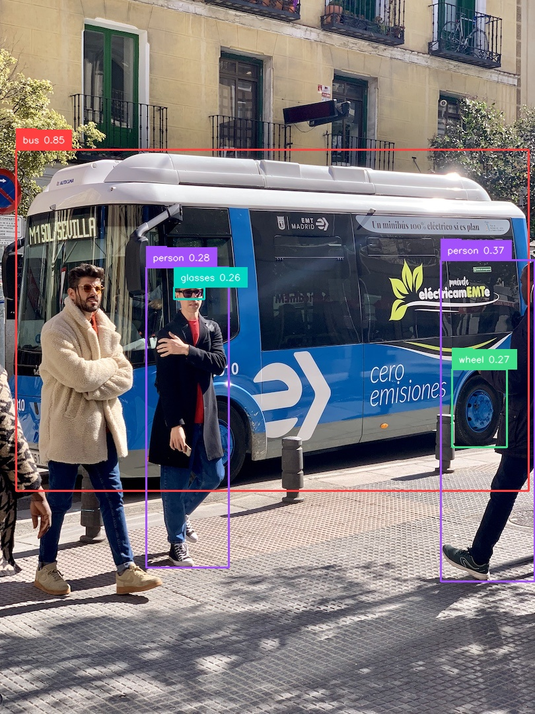
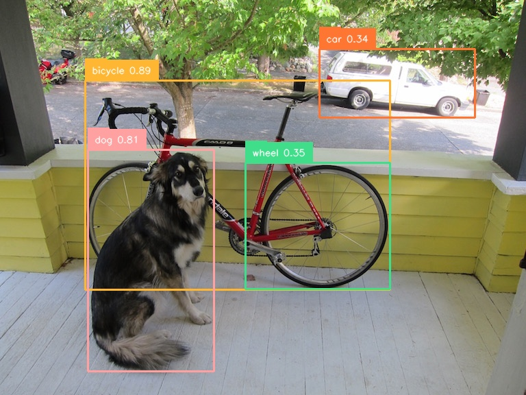

# YOLO-World 论文复现记录

## 1. 项目与论文信息

- 论文名称：YOLO-World: Real-Time Open-Vocabulary Object Detection
- 会议：CVPR 2024
- 代码仓库：https://github.com/yy0824yy/YOLO-World
- 复现任务：选择近三年 CVPR 开源论文，理解论文思路并复现代码，在自选图片上完成检测并保存可视化结果。

YOLO-World 是一个实时开放词汇目标检测模型。传统 YOLO 模型通常只能检测训练集中固定类别，而 YOLO-World 可以根据用户输入的文本提示词检测对应目标，例如 `person`、`bus`、`glasses`、`wheel` 等。

## 2. 论文基本思路

YOLO-World 的核心目标是在保持 YOLO 系列实时检测速度的同时，引入开放词汇检测能力。模型把图像特征和文本类别特征放到同一个语义空间中进行匹配，使检测类别不再局限于固定的 COCO 类别。

主要流程如下：

1. 输入图像和一组文本提示词，例如 `person,bus,dog,bicycle,wheel`。
2. 文本编码器提取每个类别名称的语义特征。
3. 图像 backbone 和 neck 提取多尺度视觉特征。
4. 检测头将图像区域特征与文本特征进行匹配，预测边界框、类别和置信度。
5. 推理阶段输出检测框，并将结果绘制到原图上。

YOLO-World 还提出 prompt-then-detect 思路：先根据用户词汇生成类别嵌入，再进行检测。这样可以在不重新训练模型的情况下切换检测类别。

## 3. 复现环境

本次复现在服务器完成。

- 项目路径：`/home/algo/chunzhuang/gy/CV/YOLO-World`
- Conda 环境：`/home/algo/anaconda3/envs/yoloworld`
- Python：3.10.20
- PyTorch：2.1.2+cu121
- MMCV：2.1.0
- MMDetection：3.3.0
- MMYOLO：0.6.0
- MMEngine：0.10.7
- Supervision：0.19.0
- GPU：NVIDIA GeForce RTX 4090

使用的配置和权重：

```bash
configs/pretrain/yolo_world_v2_s_vlpan_bn_2e-3_100e_4x8gpus_obj365v1_goldg_train_lvis_minival.py
weights/yolo_world_v2_s_obj365v1_goldg_pretrain-55b943ea.pth
```

## 4. 复现步骤

进入项目目录：

```bash
cd /home/algo/chunzhuang/gy/CV/YOLO-World
```

由于服务器访问 Hugging Face 时偶尔会出现连接重置，而本地已经存在 `openai/clip-vit-base-patch32` 缓存，所以运行时使用离线环境变量：

```bash
export HF_HUB_OFFLINE=1
export TRANSFORMERS_OFFLINE=1
export CUDA_VISIBLE_DEVICES=0
export PYTHONPATH=.
```

单图复现命令：

```bash
/home/algo/anaconda3/envs/yoloworld/bin/python -u my_reproduce_demo.py
```

批量检测命令：

```bash
/home/algo/anaconda3/envs/yoloworld/bin/python -u batch_reproduce_demo.py
```

批量检测使用的提示词：

```text
person, bus, dog, car, bicycle, horse, backpack, ball, wheel, license plate, glasses
```

## 5. 检测结果

输出目录：

```bash
reproduce_outputs/
```

运行日志：

```bash
reproduce_runs/run_basic_offline_20260608.log
reproduce_runs/run_batch_custom_20260608.log
```

主要检测结果如下：

| 图片 | 检测到的目标 | 说明 |
| --- | --- | --- |
| `reproduce_outputs/bus.jpg` | bus 0.855, person 0.368/0.277, wheel 0.267, glasses 0.256 | 效果最好，展示了开放词汇中 `glasses` 和 `wheel` 等细粒度目标 |
| `reproduce_outputs/dog.jpg` | bicycle 0.889, dog 0.806, wheel 0.355, car 0.342 | 效果很好，多个类别定位准确 |
| `reproduce_outputs/zidane.jpg` | person 0.430/0.414 | 能检测人物，但类别较单一 |
| `reproduce_outputs/demo.jpg` | 多个 car，最高 0.331 | 远处车辆能被检测，但图片较小、框和标签较密 |
| `reproduce_outputs/large_image.jpg` | car 0.456/0.409/0.318, bus 0.288 | 城市道路场景，可作为补充结果 |

推荐放入报告的结果图：





## 6. 复现结论

本次成功复现了 YOLO-World-v2-S 的开放词汇目标检测推理流程。实验说明：

- YOLO-World 可以在不重新训练的情况下，通过修改文本提示词切换检测类别。
- 对常见目标如 `bus`、`person`、`dog`、`bicycle`、`car` 检测效果较好。
- 对较细粒度目标如 `wheel`、`glasses` 也能给出检测框，体现了开放词汇检测的特点。
- 服务器环境中需要注意 Hugging Face 网络访问问题，使用本地缓存和离线模式可以稳定复现。

本次复现主要完成推理与可视化，没有重新训练模型。由于 YOLO-World 的预训练需要大规模数据和多 GPU 资源，课程复现中采用官方预训练权重进行开放词汇检测是更合理的实现方式。
